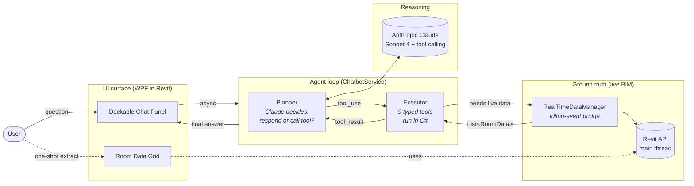
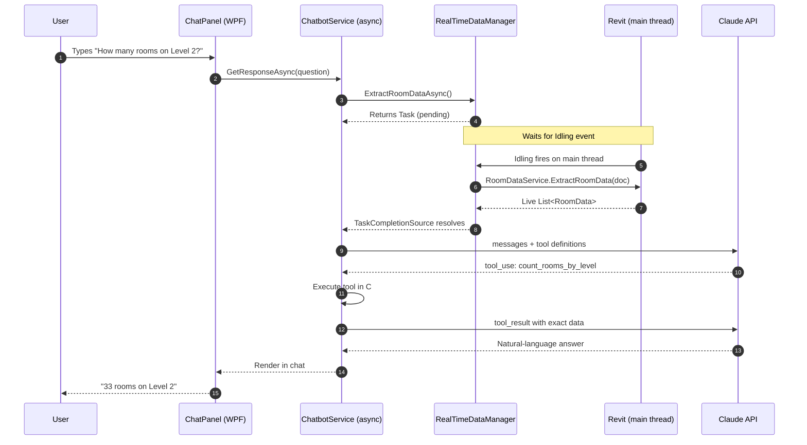

# Revit BIM Intelligence

> An **agentic AI assistant for BIM**. Ask natural-language questions about an Autodesk Revit model — Claude autonomously selects from 9 typed tools to query live building data and answer with deterministic accuracy.


---

## Demo

[](https://youtu.be/V4bqxmRZ1yc)

> Click the thumbnail to watch a full walkthrough on YouTube.

## Overview

**Revit BIM Intelligence** demonstrates an **agentic LLM workflow running inside a desktop CAD application**.

The user asks a natural-language question about a building. **Claude autonomously decides** which of 9 typed tools to call, our C# executes the tool against **live Revit API data** on the main thread, and Claude formats the result. The Revit data extractor is the deterministic backend the agent calls — it's not the headline.

The result: an LLM that can reason about a 100-room building model and answer with **exact counts**, never hallucinated numbers.

## What makes this agentic

This isn't a thin RAG wrapper or a prompt-engineering trick. It's a small, focused implementation of the **planner-executor agent pattern** with a real-world non-trivial host (Revit's single-threaded UI):

| Property                | How it's realised here                                                                                       |
| ----------------------- | ------------------------------------------------------------------------------------------------------------ |
| **LLM autonomy**        | Claude alone decides whether to call a tool and which one — no hard-coded routing or intent classifier        |
| **Typed tool interface**| 9 tools defined with JSON Schema (`count_rooms_by_level`, `find_rooms_by_area_range`, …) — the model sees names, descriptions, and argument types |
| **Deterministic execution** | Tool bodies run in C# (`ChatbotService.ExecuteTool`) — counts and aggregations come from `LINQ`, not the model |
| **Multi-step loop**     | `user → assistant(tool_use) → tool_result → assistant(text)` — proper Anthropic tool-use protocol, not a one-shot call |
| **Live state per query**| Every question re-queries Revit via `FilteredElementCollector` — no stale snapshot, no cache poisoning        |
| **Async ↔ single-threaded host bridge** | `RealTimeDataManager` uses Revit's `Idling` event + `TaskCompletionSource` so the async agent loop can safely call a UI-thread-only API |
| **No hallucination**    | The LLM's only job is to choose tools and phrase results — every number it states comes from a tool result    |

If you're learning agentic patterns, the interesting code is `src/Services/ChatbotService.cs` (the agent loop) and `src/Services/RoomDataEventHandler.cs` (the threading bridge).

## Features

- **Ribbon integration** — adds a "BIM Intelligence" tab with two buttons: *Extract Room Data* and *AI Chatbot*
- **Room Data Extractor**
  - Pulls room name, number, level, area (m²), door count, window count
  - WPF DataGrid with sortable columns
  - One-click JSON export
- **AI Chat Panel** (dockable)
  - Plain-English questions about the live model
  - 9 typed tools the LLM can call for accurate data — counts come from C#, not the model
  - Real-time fetch on every query — no manual refresh needed
- **Thread-safe Revit API access** via the `Idling` event, even from async UI code
- Self-contained PowerShell installer

## Tech Stack

Listed agent-first — the AI layer is the headline, the rest is the infrastructure that lets it run inside Revit.

| Layer                  | Technology                                                              |
| ---------------------- | ----------------------------------------------------------------------- |
| **Agent loop**         | Planner-executor (LLM picks tool → C# runs it → LLM formats result)     |
| **LLM**                | Anthropic Claude (Sonnet 4) — `/v1/messages`, `anthropic-version: 2023-06-01` |
| **Tool interface**     | 9 typed tools defined with JSON Schema, dispatched in `ChatbotService.cs` |
| **State source**       | Live Revit model — re-queried on every user message via `FilteredElementCollector` |
| **Async ↔ UI bridge**  | Revit `Idling` event + `TaskCompletionSource` (`RealTimeDataManager`)   |
| **Host application**   | Autodesk Revit 2026 API (`RevitAPI`, `RevitAPIUI`)                       |
| **UI**                 | WPF (XAML) — dockable chat panel + data grid                             |
| **Runtime**            | .NET 8 (`net8.0-windows`, x64)                                           |
| **Language**           | C# 12 (`Nullable enable`, `ImplicitUsings enable`)                       |
| **Serialization**      | `System.Text.Json` 8.0.5                                                 |
| **Build / install**    | MSBuild / `dotnet` CLI · PowerShell (`install.ps1`)                      |

## Architecture

The agent (`ChatbotService`) is the orchestrator. Everything else is a service it consults — Claude for reasoning, Revit for ground truth, the user for intent.



The dotted lines on the right show the secondary, non-agentic path: a classic Revit command that extracts the same data into a grid and JSON file. It exists mainly to prove the data layer works on its own.

## How it works (chat flow)

The trickiest part of the project: the chat UI is `async`, but the Revit API can only be touched from the main UI thread. `RealTimeDataManager` bridges them via Revit's `Idling` event and a `TaskCompletionSource`.



**Why this matters:** the LLM never does the counting itself — it picks the right tool, our C# runs against live Revit data, and the model only formats the result. So counts are exact.

## Prerequisites

- **Autodesk Revit 2026** — Windows only
- **.NET 8 SDK** — for building (Visual Studio 2022 17.8+ also works)
- **Anthropic API key** — get one at [console.anthropic.com](https://console.anthropic.com/)
- A Revit project containing **placed rooms** (the bundled Autodesk sample `rac_advanced_sample_project.rvt` works great)

## Installation

### 1. Clone and build

```bash
git clone https://github.com/tell2jyoti/RevitBIMIntelligence.git
cd RevitBIMIntelligence
dotnet build src/RevitBIMIntelligence.csproj -c Debug
```

> Revit API DLLs are referenced from `C:\Program Files\Autodesk\Revit 2026\` — adjust the `<HintPath>` entries in `src/RevitBIMIntelligence.csproj` if your install lives elsewhere.

### 2. Install the add-in

```powershell
powershell -ExecutionPolicy Bypass -File .\install.ps1
```

This copies `RevitBIMIntelligence.dll` and `RevitBIMIntelligence.addin` into:

```
%APPDATA%\Autodesk\Revit\Addins\2026\
```

For Release builds or a different Revit version:

```powershell
.\install.ps1 -Configuration Release -RevitVersion 2026
```

### 3. Set your API key

In **System Properties → Environment Variables**, add a User variable:

| Name                | Value                                |
| ------------------- | ------------------------------------ |
| `ANTHROPIC_API_KEY` | `sk-ant-...` (your key)              |

Restart Revit so it picks up the new env var.

### 4. Launch

1. Open Revit 2026 and load a project with rooms
2. Go to the **BIM Intelligence** ribbon tab
3. Click **Extract Room Data** to view and export the dataset
4. Click **AI Chatbot** to open the dockable chat panel and start asking questions

## Usage — sample queries

| Question                                          | What happens under the hood        |
| ------------------------------------------------- | ---------------------------------- |
| *How many rooms are on Level 2?*                  | `count_rooms_by_level`             |
| *Which level has the most doors?*                 | `get_building_summary`             |
| *List all rooms with area less than 20 sqm*       | `find_rooms_by_area_range`         |
| *Which rooms have no windows?*                    | `find_rooms_without_windows`       |
| *Show me the 5 largest rooms*                     | `find_largest_rooms` (count = 5)   |
| *What types of rooms are on the entry level?*     | `get_room_types_summary`           |

## AI tools available to the model

The LLM can call any of these — all execute in C# against the live Revit dataset:

| Tool                          | Purpose                                                |
| ----------------------------- | ------------------------------------------------------ |
| `count_rooms_by_level`        | Exact room count for a given level (partial match)     |
| `get_building_summary`        | Totals + per-level breakdown                           |
| `find_rooms_with_windows`     | List rooms where windowCount > 0                       |
| `find_rooms_without_windows`  | List rooms where windowCount = 0                       |
| `find_largest_rooms`          | Top N rooms by area                                    |
| `find_smallest_rooms`         | Bottom N rooms by area                                 |
| `find_rooms_by_area_range`    | Rooms with area in [min, max] m²                       |
| `count_doors_by_level`        | Total doors associated with rooms on a level           |
| `get_room_types_summary`      | Group by room name (room type), with counts and totals |

## Project structure

```
RevitBIMIntelligence/
├── src/
│   ├── App.cs                          # IExternalApplication — ribbon + dockable pane
│   ├── RevitBIMIntelligence.csproj
│   ├── Commands/
│   │   ├── RoomDataExtractorCommand.cs # IExternalCommand — extract + display + export
│   │   └── ToggleChatPanelCommand.cs   # IExternalCommand — show/hide chat panel
│   ├── Services/
│   │   ├── RoomDataService.cs          # FilteredElementCollector → RoomData[]
│   │   ├── JsonExportService.cs        # System.Text.Json export
│   │   ├── ChatbotService.cs           # Claude API + tool dispatch
│   │   └── RoomDataEventHandler.cs     # RealTimeDataManager (Idling-event bridge)
│   ├── Models/
│   │   └── RoomData.cs                 # RoomData + RoomDataExport DTOs
│   └── UI/
│       ├── RoomDataPanel.xaml(.cs)     # WPF DataGrid view
│       ├── ChatPanel.xaml(.cs)         # Dockable chat UI
│       └── ChatPanelDockable.cs        # IDockablePaneProvider
├── output/
│   └── rooms.json                      # Sample export (regenerated at runtime)
├── RevitBIMIntelligence.addin          # Revit add-in manifest
├── RevitBIMIntelligence.sln            # Solution file
├── install.ps1                         # Portable installer
├── LICENSE                             # MIT
└── README.md
```

## Threading model — note for contributors

- **All Revit API calls must happen on the main UI thread.** Touching `Document` / `FilteredElementCollector` from a background thread will throw or corrupt state.
- The `RoomDataExtractorCommand` already runs on the main thread (it's a Revit `IExternalCommand`), so it calls `RoomDataService` directly.
- The chat panel is `async` — when it needs fresh data, it goes through `RealTimeDataManager`:
  1. `ExtractRoomDataAsync()` creates a `TaskCompletionSource<List<RoomData>>` and stores it
  2. The next time Revit fires `Idling` on the main thread, the handler runs `RoomDataService.ExtractRoomData(doc)` and resolves the task
  3. The async chatbot continues with live data — no thread violations
- A 5-second timeout in `ExternalEventManager.ExtractRoomDataAsync()` falls back to the last cached snapshot if Revit isn't idling (e.g. user is mid-modal-dialog).

## Assumptions & limitations

- Tested only on **Revit 2026 / Windows**
- Only **placed rooms with area > 0** are included
- Door / window counts depend on `FromRoom` / `ToRoom` properties being set correctly in the model — unbounded openings may be missed
- Internet access required for the chatbot (calls Anthropic API)
- The chatbot session is stateless — no conversation memory across messages (yet)

## Troubleshooting

| Issue                                | Solution                                                                 |
| ------------------------------------ | ------------------------------------------------------------------------ |
| Plugin not visible in ribbon         | Check that `RevitBIMIntelligence.addin` lives in `%APPDATA%\Autodesk\Revit\Addins\2026\` |
| `API key not configured` message     | Set `ANTHROPIC_API_KEY` env var, then **restart Revit**                  |
| "No rooms found"                     | Open a project with placed rooms; unplaced rooms are skipped             |
| Door / window count is 0             | Room boundaries may not associate with the openings — check the model    |
| `dotnet build` can't find RevitAPI   | Edit the `<HintPath>` in `src/RevitBIMIntelligence.csproj`               |

## Roadmap

- [ ] Conversation memory (multi-turn context within a session)
- [ ] Highlight referenced rooms in the active Revit view (`UIDocument.Selection`)
- [ ] Export chat transcript as a Markdown report
- [ ] Support for Revit 2024 / 2025 (multi-targeted build)
- [ ] Pluggable LLM backend (OpenAI, local models via Ollama)
- [ ] Additional tools: walls, MEP equipment, schedules, sheets

## Contributing

Issues and PRs welcome. Please run `dotnet build` cleanly before opening a PR, and prefer small, focused changes — especially around the threading code, where subtle changes can break Revit API safety.

## License

[MIT](LICENSE) — do whatever you want, just keep the copyright notice.

## Acknowledgements

- [Autodesk Revit API](https://www.revitapidocs.com/) — the primary host platform
- [Anthropic Claude](https://www.anthropic.com/) — LLM and tool-calling backbone
- The Autodesk sample project `rac_advanced_sample_project.rvt` — used in the demo video
